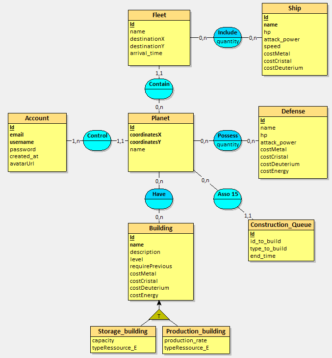

# MCD du projet



# MLD du projet


# Layout du front


# DTO flow chart


# Docker Setup for PostgreSQL and pgAdmin

## Start all containers

### Start the Containers

Run the following command in the directory where your docker-compose.yml is located:

```bash
docker-compose up -d
```

This command will start the PostgreSQL and pgAdmin containers in detached mode.

### Verify Containers

To check if the containers are running, use:

```bash
docker ps
```

You should see both postgres-db and pgadmin listed.

## Connecting to pgAdmin

Open your web browser and go to http://localhost:8081.

Log to pgAdmin using these credentials defined in the docker-compose.yml file :
- Email: **admin@admin.com**
- Password: **admin**


Add a New Server in pgAdmin :

1. Click on **"Add New Server"** in the pgAdmin dashboard.

2. In General Tab:
    - Name : PostgresDB (or any name you choose).
    
3. Connection Tab:
    - Host : **postgres-db**
    - Port : **5432**
    - Maintenance Database : **mydb**
    - Username : **myuser**
    - Password: **mypassword**

4. Save and Connect

You should now be able to browse and manage your PostgreSQL databases through pgAdmin.
